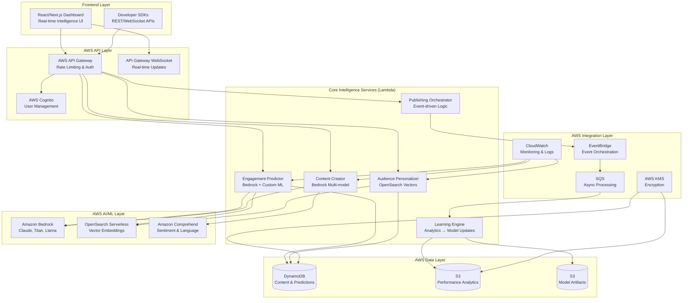

# CloudCraft AI Platform Design Document

## Overview

CloudCraft AI is a **serverless, event-driven content intelligence platform** built entirely on AWS for the "AI for Bharat" hackathon. Unlike traditional content generators, CloudCraft AI creates a **predictive, closed-loop system** that learns from every piece of content to improve future predictions.

**Core Innovation:** The platform combines Amazon Bedrock for content generation, OpenSearch for audience embeddings, and real-time analytics to create an intelligent system that gets smarter with each use - specifically designed for Indian creators, MSMEs, and startups.

**Hackathon Advantage:** Demonstrates deep AWS integration, real AI intelligence (not surface-level), and addresses genuine Bharat market needs with a demoable, scalable architecture.

## Architecture

### High-Level Architecture (AWS-Native)



### Core Services Architecture

#### 1. Engagement Prediction Service (Priority 1)
**Purpose:** Predict content performance before publishing using ML models
**AWS Stack:** Lambda + Bedrock + DynamoDB + OpenSearch
**Intelligence:** Combines content analysis, audience embeddings, and historical patterns

```python
# Lambda Function: engagement-predictor
def predict_engagement(content, audience_segment, platform):
    # Bedrock analysis for content quality
    content_features = bedrock_analyze_content(content)
    
    # OpenSearch for audience similarity
    audience_embedding = opensearch_get_embedding(audience_segment)
    
    # Historical pattern matching
    similar_content = dynamodb_query_similar(content_features)
    
    # ML prediction with confidence
    prediction = ml_model_predict(content_features, audience_embedding, similar_content)
    
    return {
        'engagement_score': prediction.score,
        'confidence': prediction.confidence,
        'factors': prediction.explanation,
        'recommendations': prediction.improvements
    }
```

#### 2. Closed-Loop Learning Engine (Priority 2)
**Purpose:** Continuously improve predictions using real performance data
**AWS Stack:** EventBridge + SQS + Lambda + S3 + DynamoDB
**Intelligence:** Compares predictions vs actual results, updates models

```python
# Event-driven learning pipeline
@eventbridge_handler('content.published')
def start_learning_cycle(event):
    content_id = event['content_id']
    
    # Queue for performance tracking
    sqs_send_message('performance-tracker', {
        'content_id': content_id,
        'prediction': event['predicted_engagement'],
        'track_duration': '7d'  # Track for 7 days
    })

@sqs_handler('performance-tracker')
def update_model_accuracy(message):
    # Get actual performance from social platforms
    actual_performance = fetch_actual_metrics(message['content_id'])
    
    # Compare with prediction
    accuracy_delta = calculate_accuracy(
        message['prediction'], 
        actual_performance
    )
    
    # Update model if significant learning opportunity
    if accuracy_delta > LEARNING_THRESHOLD:
        retrain_model_incremental(accuracy_delta)
        
    # Store learning metrics
    s3_store_learning_data(accuracy_delta)
```

#### 3. Audience Personalization Engine (Priority 3)
**Purpose:** Adapt content for different Indian audience segments
**AWS Stack:** OpenSearch + Lambda + Comprehend + DynamoDB
**Intelligence:** Vector embeddings for audience behavior and cultural context

```python
# Audience-aware personalization
def personalize_content(base_content, audience_segments):
    personalized_variants = []
    
    for segment in audience_segments:
        # Get audience embedding from OpenSearch
        audience_vector = opensearch_get_audience_embedding(segment)
        
        # Analyze cultural context needs
        cultural_context = comprehend_detect_cultural_markers(segment)
        
        # Generate personalized variant using Bedrock
        variant = bedrock_personalize_content(
            content=base_content,
            audience_vector=audience_vector,
            cultural_context=cultural_context,
            regional_preferences=get_bharat_preferences(segment)
        )
        
        # Predict performance for this segment
        segment_prediction = predict_engagement(variant, segment, platform)
        
        personalized_variants.append({
            'content': variant,
            'audience': segment,
            'predicted_performance': segment_prediction
        })
    
    return sorted(personalized_variants, key=lambda x: x['predicted_performance'])
```

#### 4. Content Creation Service (Priority 4)
**Purpose:** Generate culturally relevant content using Bedrock
**AWS Stack:** Bedrock + Comprehend + Lambda + DynamoDB
**Intelligence:** Multi-model approach with Bharat context awareness

```python
# Intelligent content creation
def create_content(prompt, platform, audience, bharat_context):
    # Analyze prompt for cultural sensitivity
    cultural_analysis = comprehend_analyze_cultural_context(prompt)
    
    # Select optimal Bedrock model based on content type
    model = select_bedrock_model(platform, content_type)
    
    # Generate content with Bharat context
    content_variants = []
    for i in range(3):  # Generate 3 variants
        variant = bedrock_generate_content(
            model=model,
            prompt=enhance_prompt_with_bharat_context(prompt, bharat_context),
            platform_optimization=get_platform_specs(platform),
            audience_tone=get_audience_tone(audience)
        )
        
        # Immediately predict engagement
        prediction = predict_engagement(variant, audience, platform)
        
        content_variants.append({
            'content': variant,
            'prediction': prediction,
            'cultural_relevance': cultural_analysis
        })
    
    # Return ranked by predicted performance
    return sorted(content_variants, key=lambda x: x['prediction']['engagement_score'], reverse=True)
```

### Data Models (DynamoDB)

#### Content Table
```json
{
  "PK": "CONTENT#<content_id>",
  "SK": "METADATA",
  "content_text": "string",
  "platform": "instagram|linkedin|twitter",
  "audience_segment": "string",
  "predicted_engagement": {
    "score": "number",
    "confidence": "number",
    "factors": ["array"]
  },
  "actual_engagement": {
    "likes": "number",
    "shares": "number", 
    "comments": "number",
    "reach": "number"
  },
  "bharat_context": {
    "region": "string",
    "language": "string",
    "cultural_markers": ["array"]
  },
  "created_at": "timestamp",
  "published_at": "timestamp"
}
```

#### Learning Metrics Table
```json
{
  "PK": "LEARNING#<date>",
  "SK": "ACCURACY",
  "prediction_accuracy": "number",
  "model_version": "string",
  "improvement_delta": "number",
  "content_count": "number",
  "bharat_performance": {
    "regional_accuracy": "object",
    "cultural_relevance_score": "number"
  }
}
```

### Event-Driven Workflows

#### Content Lifecycle Events
```yaml
Events:
  content.created:
    source: content-creation-service
    triggers: [engagement-prediction, personalization]
    
  content.predicted:
    source: engagement-predictor
    triggers: [publishing-orchestrator]
    
  content.published:
    source: publishing-orchestrator  
    triggers: [performance-tracker, analytics-collector]
    
  performance.collected:
    source: analytics-collector
    triggers: [learning-engine, model-updater]
    
  model.updated:
    source: learning-engine
    triggers: [accuracy-reporter, dashboard-notifier]
```

### AWS Service Justification (Hackathon Scoring)

#### Innovation Through AWS AI
- **Bedrock Multi-Model:** Uses Claude for creative content, Titan for embeddings, Llama for analysis
- **OpenSearch Vectors:** Sophisticated audience similarity matching
- **Comprehend:** Cultural context and sentiment analysis for Bharat relevance

#### Serverless Scalability
- **Lambda:** Auto-scaling compute for unpredictable creator workloads
- **DynamoDB:** Single-digit millisecond responses for real-time predictions
- **EventBridge:** Decoupled, event-driven architecture for reliability

#### Real-Time Intelligence
- **API Gateway WebSocket:** Live dashboard updates as learning happens
- **SQS:** Async processing for performance tracking without blocking user experience
- **CloudWatch:** Real-time monitoring of prediction accuracy and system health

### Demo Flow (30-Second Pitch)

1. **Problem (5s):** "Indian creators waste time on content that doesn't perform"
2. **Solution (10s):** "CloudCraft AI predicts engagement before publishing and learns from every post"
3. **Intelligence (10s):** Show live prediction → publish → actual results → model improvement
4. **AWS Power (5s):** "Fully serverless, scales to millions of Indian creators"

### Bharat-Specific Features

#### Cultural Intelligence
- Regional language detection and optimization
- Festival and cultural event awareness
- Local trend integration
- Regional audience behavior patterns

#### MSME Optimization
- Cost-effective serverless pricing
- Multi-language support (Hindi, English, regional)
- Small business workflow optimization
- Startup-friendly API pricing tiers

### Technical Implementation Priority

**Phase 1 (MVP Demo):**
1. Engagement Prediction Service (Bedrock + basic ML)
2. Simple Learning Loop (prediction vs actual)
3. Basic Dashboard (React + real-time updates)

**Phase 2 (Enhanced Demo):**
4. Audience Personalization (OpenSearch vectors)
5. Content Creation (Bedrock multi-model)
6. Publishing Orchestration (EventBridge)

**Phase 3 (Full Platform):**
7. Advanced Analytics
8. Developer APIs
9. Enterprise Features

This architecture maximizes hackathon scoring by demonstrating:
- **Deep AWS Integration:** Every service has clear AWS justification
- **Real AI Intelligence:** Predictive + learning capabilities, not just generation
- **Bharat Relevance:** Cultural context and regional optimization
- **Demo-Ready:** Clear 30-second story with visible intelligence
- **Scalable Foundation:** Enterprise-ready serverless architecture